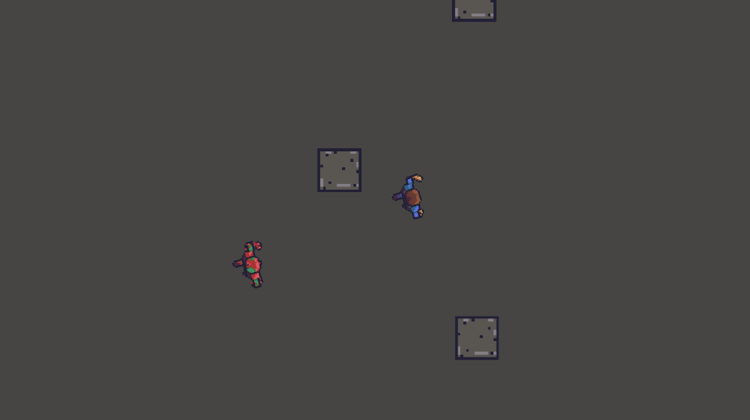

This is prototype mobile game project for Android. 
The idea for the project is to make simple top down infinite runner/shooter game and learn mobile development and behaviour trees (NodeCanvas)

## Platform
- Unity 6
- Android

### Progress
**18.8.2025**: Added basic Zombie to chase the Player. DamageArea gives dmg and pushes the player. 
**17.8.2025**: GameManager Singleton, changed the project build for Android. Player run animation works. 
**15.8.2025**: v.01 Base Unity Project with moveable character, no art or game play yet. 

## Todo (8.2025)
- Health System
    - Receive Damage
    - Visual Effects
        - Particles
    - Audio Effects
- DamageSystem
	- Push entity hit & damage
- Character Controller
    - Add raycast on forward direction, when obstacle in front, stop movement
- CameraFollow
    - CinemaMachine target follow
- MainMenu
- GameLoop
    - MainMenu
    - Start
    - GameLoop
    - Game Ended
    - Restart
- Zombies
    - Zombie Movement. Raycast based
    - Random Speed
    - Obstacle avoidance
- Spawning
    - With curves. More time => faster spawning
- Level
    - Random level generation with prefabs / level props.
- Item System
	- Usable Item or auto use?
	    - Weapons, 1 time use, drop after use
            (ex; shotgun, 7 ammo, autoshoot. Drop after no more bullets)
	    - Speed
            Increase speed for 5 seconds
	    - Health
            Full health
- **Graphics**
	- Player
	- Zombies
	- HUD
		- HealthBar
		- Item / Weapon
		- Inputs
	- Level Props
		- Asphalt
		- Grass
		- Sand
		- Walls
        - House roofs
        - Street lights
	- Lights
        -Light halo sprites

## Required Plugins $
These were removed from the repository because some of them needs licensed from Unity Asset Store.
- NodeCanvas ($)
- MoreMountain - Feel ($)
- Mobile Tools v2.0 + Example Game (free)