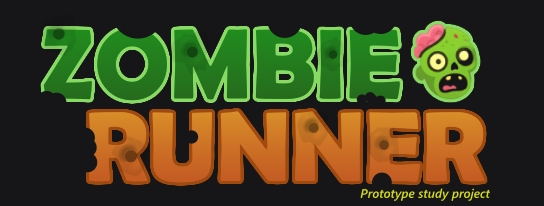
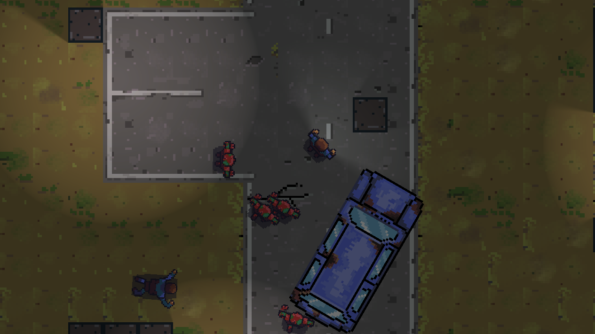

This is prototype mobile game project for Android. 
The idea for the project is to make simple top down infinite runner/shooter game 
and learn mobile development and behaviour trees (NodeCanvas)

## Platform
- Unity 6
- Android

### Progress
**1.9.2025**: Mockup HUD & Start/End screen. Timer & Spawning system for Zombies. Player has obstacle avoidance with Raycasts 
**23.8.2025**: Health + Speed pickups. 
**19-20.8.2025**: Deathprefab, floor mockup sprite. Interface for pushable entities. etc 
**18.8.2025**: Added basic Zombie to chase the Player. DamageArea gives dmg and pushes the player. 
**17.8.2025**: GameManager Singleton, changed the project build for Android. Player run animation works. 
**15.8.2025**: v.01 Base Unity Project with moveable character, no art or game play yet. 

## Todo (8.2025)
- [ ] Health System
    - [x] Receive Damage
    - [x] Visual Effects
        - [ ] Particles
    - [ ] Audio Effects
- [ ] DamageSystem
	- [x] Push entity hit & damage
- [ ] Character Controller
    - [x] Add raycast on forward direction, if obstacle in exactly perpendicular in front, stop movement.
    - [ ] Use forward raycast to auto steer away from obstacle diretly in front, using the normal of the obstacle. 
    - [ ] Move backwards with possibility to turn left/right.
- [x] CameraFollow
    - CinemaMachine target follow
- [ ] Weapon System
    - [ ] Auto shooting & Aiming
- [ ] MainMenu
- [ ] GameLoop
    - [ ] MainMenu
    - [x] Start
    - [x] GameLoop
    - [x] Game Ended
        - [x] Show Score & Menu buttons
    - [x] Restart
- [ ] Zombies
    - [ ] Zombie Movement. Raycast based, turn away from obstacles. Calculate turning by crossproduct of the target vs obstacle. 
    - [x] Random Speed
    - [ ] Obstacle avoidance
- [x] Spawning
    - [x] With curves. More time => faster spawning
- [ ] Level
    - [ ] Random level generation with prefabs / level props.
- [ ] Item System
	- [ ] Usable Item or auto use?
	    - [ ] Weapons, 1 time use, drop after use
            (ex; shotgun, 7 ammo, autoshoot. Drop after no more bullets)
	    - [x] Speed
            Increase speed for 5 seconds
	    - [x] Health
            Full health
    - [ ] Loot Drop
- **Graphics**
	- [x] Player
	- [ ] Zombies
        - [x] Default Zombie
        - [ ] Big Zombie
        - [ ] Slime Zombie 
	- [ ] HUD
		- [ ] HealthBar
		- [ ] Item / Weapon
		- [ ] Inputs
	- [ ] Level Props
		- [ ] Asphalt
		- [ ] Grass
		- [ ] Sand
		- [ ] Walls
        - [ ] House roofs
        - [ ] Street lights
	- [ ] Lights
        - [ ] Light halo sprites

## Required Plugins $
These were removed from the repository because some of them needs licensed from Unity Asset Store.
- NodeCanvas ($)
- MoreMountain - Feel ($)
- Mobile Tools v2.0 + Example Game (free)